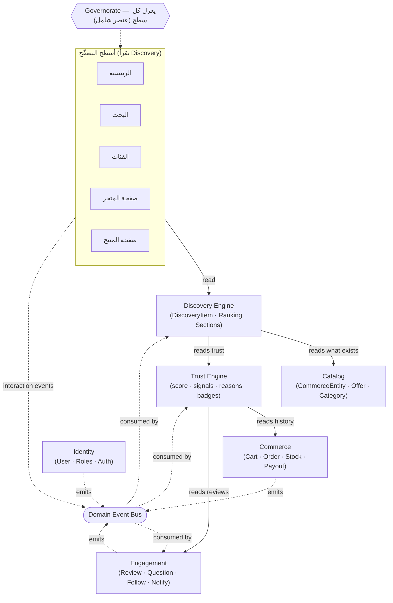

# خريطة مجال السوگ — الوثيقة المرجعية (Domain Map)

> **الحالة:** معتمدة كمرجع للرؤية الجديدة · **النوع:** خريطة مجال (Domain Map)، وليست ERD ولا مخطّط قاعدة بيانات.
> ترتيب التنفيذ المعتمد: **المرحلة 0 (معمارية التجربة/IA — انظر `home-architecture.md`) ← A: `DiscoveryItem` العام ← B: إعادة بناء الرئيسية ← C: هوية الكيان التجاري ← D: البحث.** أي ميزة تُوضَع على هذه الخريطة **قبل** كتابة سطر كود.

---

## 0. المبدأ الحاكم (الدستور بسطر واحد)

**السوگ = خريطة السوق العراقي الحقيقي: جهاتٌ موثوقة أولاً، ثم ما تعرضه.**
ترتيب الكيانات في وعي المستخدم: 🏬 متجر فعلي ← 📱 بيج موثّق ← 📦 عرض (منتج) ← ⭐ مجموعة.

> **معيار قبول أي قرار:** هل يجعل السوگ أقرب إلى أن يكون *نقطة البداية لكل عملية شراء في العراق*؟ لا → لا يدخل، مهما كانت جودته التقنية.

**القاعدة المعمارية المصحّحة:** Discovery هو مركز **الاكتشاف والتصفّح**، لا مركز كل شيء.
> كل سطح *هدفه مساعدة المستخدم على اكتشاف ما يريد* يستهلك Discovery. أمّا نواة الشراء (السلة/الطلب/الدفع) فلا تعتمد عليه. **الغراء بين كل السياقات = Domain Events.**

---

## 0.1 الكيان الأساسي (Primary Entity) — القرار الأخطر

**الكيان الأساسي في السوگ ليس Product ولا Store، بل `CommerceEntity`.**
المتجر الفعلي والصفحة الإلكترونية الموثّقة **مواطنان من الدرجة الأولى**؛ العروض والمنتجات هي ما يقدّمانه.

**التسلسل الرسمي (يحكم البحث والروابط وDiscovery وSEO والمشاركة والتوصيات وصفحات المحافظات):**

```
Governorate  →  Marketplace  →  CommerceEntity (متجر فعلي | صفحة موثّقة | …)  →  Offer  →  Product
```

**`CommerceEntity` عام عمداً** (قرار يحمي المشروع لعشر سنوات): قد يكون متجراً فعلياً، صفحة إلكترونية، شركة، مطعماً، صيدلية، ورشة، مركزاً طبياً، مكتبة، معرض سيارات… النوع صفة (`kind`)، لا كيان جديد.

**`Offer` عامٌّ كذلك، و`Product` نوعٌ منه** (تصحيح CTO): بعض الكيانات لا تبيع «منتجات» بل خدمات أو أصنافاً (قائمة طعام، خدمة ورشة، إعلان سيارة). لذا `Offer = { Product | Service | Listing | MenuItem | … }`. نحن اليوم نطبّق نوعاً واحداً (`Product`) فقط، لكن **التجريد `Offer` هو العقد**، فلا نُعيد التصميم حين يأتي مطعم أو ورشة.

> **انضباط ضدّ الـOver-Engineering:** نثبّت *التجريد* الآن (`CommerceEntity` + `Offer` عامّان)، ونُطبّق *نوعين فقط* من الكيانات (متجر/صفحة) و*نوعاً واحداً* من العروض (منتج). الباقي خانات نوع محجوزة، لا كود.

---

## 0.2 مبادئ مثبّتة قبل المرحلة A (جولة الاعتماد الأخيرة)

أربعة مبادئ تُغلَق الآن كي لا نُعيد التصميم لاحقاً. **تُثبَّت مفاهيمياً، ولا يُنفَّذ منها في A/B إلّا ما تحته سطر.**

**1) `Offer` هو التجريد العام للعروض** — مؤكّد (§0.1). ملابس→Product · مطعم→MenuItem · ورشة→Service · عقار→Listing… كلها `Offer`.

**2) `Marketplace` طبقةٌ محجوزة بين `Governorate` و`CommerceEntity`** — لتمثيل الأسواق العراقية الحقيقية: الشورجة، الحويش، العشار، الكرادة، المنصور، شارع الرسول… الواقع ليس «محافظة ← جهة» بل «محافظة ← **سوق** ← جهة».
> **ضبط CTO (يمنع ألماً لاحقاً):** (أ) العضوية **اختيارية**: `CommerceEntity` ينتمي إلى **0..1 Marketplace** — البيجات الإلكترونية قد لا تنتمي لسوقٍ فعلي (أو تُجمَّع في سوق افتراضي لاحقاً). (ب) **`Marketplace` ≠ `Area`**: الـArea جغرافيا إدارية؛ الـMarketplace **عنقود تجاري مُسمّى ومُنسَّق** (قد يقع في منطقة، أو شارع، أو يمتدّ). — **لا يُنفَّذ في A/B**؛ محجوز في النموذج فقط، يُفعَّل حين نبدأ تنسيق الأسواق.

**3) من «Commerce Entity» إلى «Commercial Identity»** — الثقة ليست درجة، بل **هوية تجارية**: موثّق · منذ ٨ سنوات · متجر فعلي · يردّ خلال ساعة · معدّل إلغاء منخفض · سُلّم ١٢٠٠ مرة · يوصي به المشترون. لذا بطاقة الكيان = **بطاقة الهوية التجارية (Commercial Identity Card)** — أهمّ عنصر في المشروع.
> **ضبط CTO (فصل الحدود):** «الهوية التجارية» **إسقاط (projection)**، لا سياق مالك جديد: تُجمَّع من **حقائق Catalog** (العمر، عدد الطلبات المُسلّمة، محل فعلي، ساعات) + **تركيب Trust** (موثّق، إلغاء منخفض، ردّ سريع، موصى به). تُركَّب عند سطح العرض. — وتنبيه تسمية: هي **ليست** سياق `Identity` (المستخدم/المصادقة)؛ اسمها الكامل **Commercial Identity** دائماً. — تُنفَّذ في **المرحلة C**.

**4) `Governorate` سياقٌ كامل (Context)، لا فلتر** — لكل محافظة اكتشافها وترندها وأسواقها ومناسباتها وهويتها البصرية؛ ينتقل المستخدم بين المحافظات فيبدو التطبيق وكأنه **يتغيّر**.
> **ضبط CTO (تدرّج):** نحجز `GovernorateContext` (ثيم بصري · أسواق مميّزة · مناسبات موسمية) — لكن **نُنفّذ الآن عزل البيانات فقط** (موجود أصلاً في Discovery)؛ الثيم والمناسبات لاحقاً.

**التسلسل الرسمي المُحدَّث:** `Governorate → Marketplace(0..1) → CommerceEntity → Offer(→Product)`.

---

## 1. السياقات المحدودة (Bounded Contexts)

ستة سياقات. لكلٍّ مسؤولية واحدة، وما يملكه، وما **لا** يملكه (الحدّ).

| السياق | مسؤوليته (سؤال واحد) | يملك | لا يملك (الحدّ) |
|---|---|---|---|
| **Identity** | مَن المستخدم وما صلاحياته؟ | User, Role, Staff/Permissions, Auth (OTP/Session), Governorate-of-user | لا يعرف شيئاً عن العروض أو الطلبات |
| **Catalog** | ما هو معروض في السوق؟ | **CommerceEntity** (متجر فعلي/بيج)، **Offer** (منتج+متغيّرات)، Category، Media، الجغرافيا (Governorate/Area) | لا يقرّر مَن يظهر أولاً، ولا يحسب الثقة |
| **Commerce** | كيف يتمّ التبادل الفعلي؟ | Cart, Order, OrderItem, Stock/Reservation, Commission, Payout, Delivery (COD), آلة الحالة | لا يرتّب، لا يكتشف، لا يقيس الثقة |
| **Trust** | لماذا نثق بهذه الجهة؟ | **Trust Engine** لكل CommerceEntity ← يُركِّب **الهوية التجارية**: `{ score, signals, reasons, badges, narrative }` | لا يبيع، لا يرتّب مباشرةً — يُصدِّر تركيب ثقة يُدمج مع حقائق Catalog في «الهوية التجارية» |
| **Discovery** | ماذا يرى المستخدم، ومتى، وبأي ترتيب؟ | **DiscoveryItem**، Section، Ranking (الدستور/الأوزان)، الأسطح (Home/Search/Category/Related) | **لا يملك أي كيان** — كله بيانات مُستعارة، قراءة وترتيب فقط، لا يكتب في قاعدة |
| **Engagement** | كيف يتفاعل الناس ويُبلَّغون؟ | Review, Question, Follow *(لاحقاً)*, Notification (قنوات) | لا منطق أعمال؛ يُنتج إشارات ورسائل فقط |

> **ملاحظة تنفيذية:** هذه السياقات **حدود مجلّدات** داخل `packages/domain` و`packages/api` الآن — **لا حزم منفصلة**. الفصل إلى حزم يُؤجَّل حتى يظهر احتكاك حقيقي (تفادياً لـ Over-Engineering).

---

## 2. الكيانات الجوهرية والمفردات الرسمية

الرؤية الجديدة تُعيد تسمية مركز الثقل. الجدول يربط المفردة الرسمية بما هو مبنيّ اليوم (الهجرة تدريجية، لا إعادة كتابة):

| المفردة الرسمية | المعنى | ما يقابلها اليوم في الكود |
|---|---|---|
| **CommerceEntity** | **الكيان الأساسي.** الجهة التي نشتري منها. `kind` عام: **PhysicalStore** \| **OnlinePage** \| (لاحقاً: مطعم/صيدلية/ورشة/معرض…). هي القلب — «مَن». | `VendorProfile` (+ حقل `kind` لاحقاً) |
| **Offer** | ما تعرضه الجهة — **تجريد عام**: `Product \| Service \| Listing \| MenuItem \| …`. اليوم نطبّق `Product` فقط. نتيجة، لا هوية. | `Product` + `ProductVariant` (كنوع `Product` من `Offer`) |
| **Governorate** | **سياق كامل** يعزل ويُخصّص كل سطح (اكتشاف/ترند/أسواق/مناسبات/هوية بصرية) — لا مجرّد فلتر. | `Governorate` / `Area` |
| **Marketplace** *(محجوز)* | السوق العراقي الحقيقي (الشورجة/الحويش/العشار…) بين المحافظة والجهة. عضويّة **اختيارية** (0..1)، **≠ Area**. | *غير موجود — محجوز للنموذج، لا يُنفَّذ في A/B* |
| **Category** | تصنيف يقطع العرض أفقياً. (منفصل عن **نوع نشاط الكيان**: مطاعم/صيدليات…) | `Category` |
| **DiscoveryItem** | **المُغلّف العام** الذي يرتّبه المحرّك: `{ type: entity\|offer\|collection\|…, id, score, reasons, metadata }`. | *غير موجود بعد — أهمّ إضافة* |
| **Commercial Identity** | **إسقاط** = حقائق Catalog (عمر/طلبات/محل فعلي/ساعات) + تركيب Trust (توثيق/إلغاء/ردّ/توصية). أهمّ عنصر بصري = **Commercial Identity Card**. ليست سياق `Identity` (المصادقة). | *يُركَّب في المرحلة C* |
| **TrustProfile** | تركيب ثقة CommerceEntity: score + signals + reasons + badges + سردية — يُغذّي الهوية التجارية. | *مبدئياً `storeTrust` رقم — يصبح Engine* |
| **Review / Question / Follow** | محتوى المستخدم الذي يُغذّي الثقة والاكتشاف. | `Review` موجود؛ Question/Follow لاحقاً |

> **هوية المتجر قصّة لا حقول:** بطاقة CommerceEntity تكبر لاحقاً لتشمل: منذ متى، عدد الطلبات، سرعة الردّ، المحافظات المخدومة، محل فعلي/صوره، ساعات العمل، مَن يديره، وسائل التواصل. نبدأ بأقلّ ما يلزم (التوثيق/النوع/النشاط) ونُنمّيها.

---

## 3. الخريطة البصرية — مَن يستهلك مَن، ومَن يُطلق الأحداث



**كيف تُقرأ الخريطة:**
- **خطوط صلبة = قراءة متزامنة الآن:** الأسطح تقرأ Discovery؛ Discovery يقرأ Catalog (ما هو موجود) و Trust (بمن نثق)؛ Trust يقرأ تاريخ Commerce والمراجعات.
- **خطوط متقطّعة = أحداث (الغراء):** Commerce و Engagement و Identity والأسطح **تُطلق** أحداثاً على الناقل؛ Trust و Discovery و Engagement **تستهلك** ما يخصّها. لا استدعاء مباشر متبادل.
- **الحدّ الأحمر:** Commerce (الشراء) لا يعرف Discovery. أبداً.
- **Governorate** يعزل كل سطح (ليس صندوقاً في السلسلة، بل بُعد شامل).

---

## 4. سلسلة العلاقات (بلغة المجال، لا قاعدة البيانات)

```
Governorate  ──يعزل──▶  CommerceEntity  ──يعرض──▶  Offer  ──يُصنَّف──▶  Category
                             │                        │
                             ▼                        ▼
                        TrustProfile            DiscoveryItem  ◀── يلتقط كليهما (Entity | Offer)
                             ▲                        ▲
        Review · Question · Follow ──تُغذّي الثقة والاكتشاف──┘
```

القراءة: **الجهة أولاً** (CommerceEntity داخل محافظة) → لها ثقة (TrustProfile) وتعرض عروضاً (Offer) → كلاهما يدخل الاكتشاف كـ **DiscoveryItem** → محتوى المستخدم (Review/Question/Follow) يرفع الثقة ويؤثّر في الترتيب.

---

## 5. الحدود الصارمة (قائمة الـ«لا»)

1. **Commerce لا يعرف Discovery ولا Trust** — يُطلق أحداثاً فقط (OrderPlaced/Delivered/Cancelled).
2. **Discovery لا يملك كياناً ولا يكتب في قاعدة** — يقرأ Catalog و Trust ويرتّب. نقطة.
3. **Trust لا يبيع ولا يرتّب** — يقيس ويُصدّر `TrustProfile`. مَن يعرضه (بطاقة) ومَن يستهلكه (ترتيب) شأنهما.
4. **Checkout / Cart / Order / Payment لا تستهلك Discovery** — أسطح معاملات لا اكتشاف.
5. **Search سطحٌ من Discovery، لا نظام مستقل** — يمرّ عبر نفس المُغلّف والترتيب.
6. **`packages/domain` لا يصبح God Module** — حدوده الداخلية هي السياقات الستّة أعلاه من اليوم.

---

## 6. Domain Events — الغراء (القاعدة: الأسطح تُطلق، السياقات تستهلك)

| الحدث | مَن يُطلقه | مَن يستهلكه |
|---|---|---|
| `OrderPlaced` / `OrderDelivered` / `OrderCancelled` | Commerce | Trust (نشاط/إلغاء)، Discovery (شعبية/مبيعات ٧ أيام)، Notification |
| `ReviewCreated` | Engagement | Trust (جودة)، Discovery (تقييم)، Notification |
| `StoreFollowed` | Engagement | Trust (نشاط)، Discovery (تفضيل)، Notification |
| `QuestionCreated` | Engagement | Discovery (محتوى)، Notification |
| `ProductViewed` / `StoreOpened` / `SearchPerformed` | الأسطح | Discovery (إعادة ترتيب V2)، التحليلات (V2) |
| `UserRegistered` / `StaffChanged` | Identity | Notification، التدقيق |

> تصنيف الأحداث موجود اليوم (`domain/src/discovery/events.ts`) والسِّنك no-op في V1. القيمة: **الأسماء ثابتة الآن**، فيصير تسجيلها لاحقاً «إضافة تخزين» لا إعادة تصميم.

---

## 7. أين تنتمي أي ميزة جديدة؟ (اختبار الخريطة)

| الميزة | تُبنى في | تُطلق | تُستهلك من |
|---|---|---|---|
| شارة توثيق متجر | **Trust** (badge) | — | Discovery (ترتيب)، الواجهة (بطاقة) |
| متابعة متجر | **Engagement** (Follow) | `StoreFollowed` | Trust، Discovery، Notification |
| سؤال على منتج | **Engagement** (Question) | `QuestionCreated` | Discovery، Notification |
| «بيجات موثّقة» في الرئيسية | **Discovery** (Section من DiscoveryItem type=entity) | — | يقرأ Catalog+Trust |
| فيديو/Reel للمتجر (لاحقاً) | **Catalog/Engagement** (نوع محتوى) | — | Discovery (DiscoveryItem type=video) |

إن لم تجد للميزة مكاناً على هذه الخريطة → الميزة غير مُعرّفة بعد؛ نُعرّفها قبل بنائها.

---

## 8. ما نؤجّله صراحةً (الخريطة تحجز مكانه)

- تقسيم `domain` إلى حزم منفصلة · Read Model / Materialized View لـ Discovery · تخزين الأحداث وخطّ التحليلات · إشارات الثقة الثقيلة (سرعة الرد، معدّل الإلغاء، جودة المراجعات بالـNLP) · الرسم الاجتماعي (أشخاص/متابعة عميقة) · الأسئلة والفيديو (Tiers 4–6).
- كلها **محجوزة** كأنواع `DiscoveryItem` أو إشارات `TrustProfile` أو أحداث — تُضاف دون إعادة تصميم.

---

## 9. القاعدة الذهبية

> **Catalog يقول ما هو موجود · Trust يقول بمن نثق · Discovery يقرّر ماذا نرى · Commerce ينفّذ الشراء · Events تربطهم · Governorate يعزلهم.**
> المنتج نتيجة، لا هوية. الجهة الموثوقة هي الهوية.
