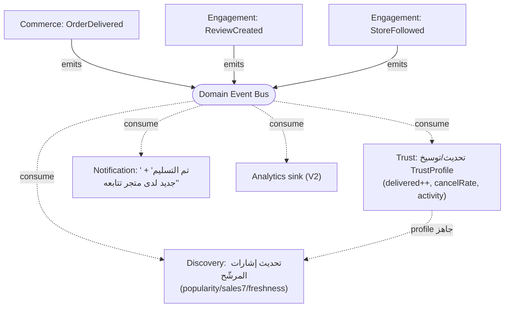

# المرحلة A — التصميم التقني لعقد Discovery (وثيقة معمارية)

> **الحالة:** تصميم للاعتماد قبل التنفيذ · **النوع:** تصميم تقني (Technical Design)، لا قائمة مهام.
> مرجعاها: `domain-map.md` و`home-architecture.md`. الهدف: صياغة **عقد `DiscoveryItem`** بحيث لا نحتاج إعادة تصميم طبقة الاكتشاف مرّةً أخرى.
> مقاطع الكود أدناه **عقودٌ (contracts)** لا تنفيذ — تُثبِّت الأشكال والحدود.
> **§9 «الثوابت المعمارية» هي المرجع الحاكم لكل مراجعة كود** — أي PR يخالف ثابتاً يُرفَض.

---

## الفكرة الحاملة (تُلخّص كل ما بعدها)

> Discovery لا يعرف «الكيانات». يعرف **إشارات مطبّعة** فقط.
> كل نوع يُسقِط نفسه إلى نفس المتجه القصير من الإشارات عبر **مُسقِط (Projector)**، ثم يرتّب **مُصنِّفٌ واحدٌ محايد للنوع** المتجهاتِ. بطاقةُ العرض تمرّ **معتمة** خلال المحرّك.

```
مصدر خام (Entity/Offer/…) ──Projector[type]──▶ DiscoveryItem{ signals, card(معتمة) } ──Ranker(محايد)──▶ Section
```

إضافة نوع جديد = **مُسقِط + مِلَفّ أوزان**. لا تعديل في منطق الترتيب. هذا هو العقد.

---

## 1. عقد `DiscoveryItem`

**الحقول المشتركة (يقرأها المحرّك):**

```ts
export type DiscoveryItemType =
  | "commerce_entity" | "offer"                       // المرحلة A
  | "marketplace" | "question" | "review" | "video";  // محجوزة (خانات نوع فقط)

/** متجه الإشارات — كلها مطبّعة [0..1] ومقارَنة عبر كل الأنواع. هذا كل ما يراه الترتيب. */
export interface RankingSignals {
  popularity: number; // نشاط/طلب مطبّع
  quality: number;    // تقييم بايزي/جودة
  freshness: number;  // تلاشٍ زمني
  trust: number;      // من Trust (للكيان) أو ثقة متجره (للعرض)
}

/** مفاتيح تجميع للتنوّع فقط — ليست تفاصيل كيان. */
export interface GroupKeys { store?: string; category?: string; market?: string }

/**
 * القدرات — مفردات مغلقة تصف *ما يمكن فعله* بالعنصر. الواجهة ترسم الأزرار منها،
 * لا من النوع (فلا `if(type==='restaurant')`). يملؤها المُسقِط من إعداد المصدر
 * (كيانان من نفس النوع قد يختلفان: أحدهما يبيع ويتّصل، آخر يتّصل فقط).
 */
export type Capability =
  | "order" | "book" | "reserve"          // شراء/حجز/موعد
  | "follow" | "review" | "question"      // تفاعل
  | "call" | "navigate" | "share";        // تواصل/مشاركة
export type Capabilities = ReadonlySet<Capability>; // أو Record<Capability, boolean>

export interface DiscoveryItem<TCard = unknown> {
  type: DiscoveryItemType;
  id: string;
  governorateId: string | null;   // للعزل بالسياق
  createdAt: Date;
  signals: RankingSignals;         // ← يقرأه Ranker فقط
  groupKeys: GroupKeys;            // ← يقرأه التنوّع فقط
  capabilities: Capabilities;      // ← تقرأه الواجهة (أزرار الإجراءات) — لا النوع
  reasons: ReasonCode[];
  exclusion: ExclusionCode | null;
  card: TCard;                     // ← معتمة على Discovery؛ يرسمها السطح فقط
}
```

> **مفردات القدرات مغلقة** (enum): إضافة قدرة قرارٌ مقصود (كإضافة اسم حدث)، فتبقى الواجهة قادرة على رسم كلٍّ منها بعمومية. **Discovery لا يرتّب على القدرات ولا يفرّع عليها** — يحملها للسطح فقط. هذا يمنع مئات `if(type===…)` مستقبلاً (المطعم `book`، الطبيب `reserve`, الورشة `book`, المتجر `order`, البيج قد لا يملك `order`).

**الحقول الخاصة بكل نوع:** تعيش كلّها داخل `card` (معتمة)، **لا في المحرّك**. أمثلة الـ`card` لكل نوع:

| النوع | ما يمثّله | `card` (معتمة على Discovery) |
|---|---|---|
| `commerce_entity` | المتجر/البيج | `CommercialIdentityCard` (اسم، توثيق، تقييم، نوع نشاط، عدد عروض، جديد الأسبوع، هوية/ثقة) |
| `offer` (اليوم = `Product`) | العرض | `OfferCard` (عنوان، سعر، صورة، متجره) |
| `marketplace` *(محجوز)* | السوق (الشورجة…) | `MarketplaceCard` (اسم، عدد جهات، محافظة) |
| `question` / `review` / `video` *(محجوز)* | محتوى | البطاقة الخاصّة بكلٍّ |

**كيف يبقى Discovery جاهلاً بتفاصيل الكيانات؟** ثلاث قواعد صارمة:
1. الترتيب يقرأ `signals` و`groupKeys` و`type` فقط — **لا `card` أبداً**.
2. تحويل «مصدر خام → `signals` + `card`» يحدث في **Projector** خارج نواة الترتيب.
3. `card` نوعها `unknown` في المحرّك؛ فلا يستطيع فيزيائياً قراءة تفاصيلها.

---

## 2. استراتيجية الترتيب (Ranking Strategy)

**القرار: Registry من المُسقِطات + مُصنِّف واحد مشترك بمِلَفّات أوزان لكل نوع.** (ليس Strategy مستقلاً لكل نوع، وليس if/else.)

**لماذا مُصنِّف مشترك لا `scoreEntity()`/`scoreOffer()` مستقلة؟** لأن أقسام مثل «اليوم» **تخلط الأنواع**؛ فيجب أن تكون النقاط **قابلة للمقارنة على نفس المقياس**. مُصنّفات مستقلة تنجرف عن المقياس فيصبح الخلط بلا معنى. الحلّ: **صيغةٌ واحدة على إشاراتٍ مطبّعة**، والتمييز عبر **أوزان تختلف بالنوع** (بيانات، لا فروع كود).

```ts
export type WeightProfile = Record<keyof RankingSignals, number>; // مجموعها ≈ 1

/** «الدستور»: أوزان لكل نوع. الكيان يرجّح الثقة؛ العرض يرجّح الشعبية (= السلوك الحالي). */
export const WEIGHT_PROFILES: Record<DiscoveryItemType, WeightProfile> = {
  commerce_entity: { trust: 0.40, quality: 0.25, popularity: 0.20, freshness: 0.15 },
  offer:           { popularity: 0.40, quality: 0.25, freshness: 0.25, trust: 0.10 },
  // الأنواع المحجوزة: مِلَفّ افتراضي حتى يُضاف مُسقِطها.
};

/** مُصنِّف واحد محايد للنوع. popMax للتطبيع داخل مجموعة المرشّحين. */
export function scoreItem(it: DiscoveryItem): number {
  if (it.exclusion) return 0;
  const w = WEIGHT_PROFILES[it.type];
  const s = it.signals;
  return w.popularity * s.popularity + w.quality * s.quality + w.freshness * s.freshness + w.trust * s.trust;
}
```

**المُسقِط والـRegisterProjector:**

```ts
export interface Projector<TSource, TCard> {
  type: DiscoveryItemType;
  project(source: TSource, ctx: ProjectionContext): DiscoveryItem<TCard>;
}
const REGISTRY = new Map<DiscoveryItemType, Projector<unknown, unknown>>();
export const registerProjector = (p: Projector<any, any>) => REGISTRY.set(p.type, p);
```

**إضافة نوع جديد (مثال Video لاحقاً):** اكتب `videoProjector` + أضف `WEIGHT_PROFILES.video` + سجّله. **صفر تعديل** في `scoreItem` أو الأقسام أو الأسطح.

**الأقسام تصريحية (config لا كود):**

```ts
export interface SectionSpec {
  key: string;
  itemTypes: DiscoveryItemType[];        // ما الأنواع المرشّحة
  predicate?: (it: DiscoveryItem) => boolean; // مثل: reasons ⊇ NEW
  sort: "score" | "freshness" | "popularity" | "quality";
  diversity: { perStore: number; perCategory: number };
  limit: number;
}
// ترتيب الرئيسية (home-architecture §4) يصبح مصفوفة SectionSpec — جهاتٌ أولاً ثم عروض.
```

إضافة/إعادة ترتيب قسم = تعديل مصفوفة، لا كود.

---

## 3. أسطح الاستهلاك (Surfaces)

كل الأسطح تنادي `DiscoveryService` وحده؛ كلها تمرّ بنفس الأنبوب: **candidates → project → rank → sections**.

| Surface | ماذا يطلب | ماذا يُعيد |
|---|---|---|
| **Home** | `home({ governorateId })` | أقسام مُنمّطة مرتّبة (كيانات → بيجات → عروض → …) |
| **Search** | `search({ q, governorateId, filters })` | `DiscoveryItem[]` مختلط (كيانات + عروض) مرتّب بنفس المُصنِّف |
| **Category** | `category({ categoryId, governorateId, sort })` | عروض (+ كيانات ذلك النشاط) مرتّبة |
| **Marketplace** *(محجوز)* | `marketplace({ marketplaceId })` | كيانات السوق + عروضها |
| **Entity (related)** | `related({ entityId })` | عروض الجهة مرتّبة + جهات شبيهة |
| **Offer (related)** | `related({ offerId })` | عروض شبيهة + هوية الجهة |
| **Notifications** | `digest({ userId })` | «جديد لدى مَن تتابع» — يستهلك Discovery لتأليف الملخّص |

> **Search سطحٌ من Discovery** (لا نظام مستقل): يُبدّل «مصدر المرشّحين» بنتيجة استعلام، ثم نفس المُسقِط/المُصنِّف. هذا يحقّق «Discovery طبقة عامة» فعلاً.

---

## 4. العلاقة مع Trust (عقد ثنائي الاتجاه صارم)

**القاعدتان:** Discovery **لا** يستعلم القاعدة ليحسب الثقة؛ وTrust **لا** يعتمد على Discovery.

**العقد:** الثقة تصل إلى Discovery **كإدخالٍ جاهز** عبر مُسقِط الكيان — لا يعرف Discovery *كيف* حُسبت.

```ts
/** ما يستهلكه مُسقِط الكيان. مصدره مبدّل خلف بوابة (port). */
export interface TrustProvider {
  forEntity(facts: EntityTrustFacts): TrustProfile; // { score0..1, badges, reasons, signals }
}
```

- **المرحلة A (بلا جداول):** `TrustProvider` = **دالة نقية** في وحدة Trust تحسب `score` من الحقائق الرخيصة المُحمّلة أصلاً (تقييم بايزي + توثيق-إن-وُجد + عمر + نشاط). مُسقِط الكيان يناديها ليملأ `signals.trust`. **منطق الثقة في Trust، والمحرّك يستدعيه عبر البوابة فقط.**
- **مستقبلاً (مقياس):** `TrustProvider` يقرأ **`TrustProfile` مُخزّناً** (Read Model يُحدّثه حدث `OrderDelivered`). **العقد لا يتغيّر** — يتغيّر *مصدر* الملمح فقط (محسوب ↔ مخزّن).

اتجاه الاعتماد: `discovery.entityProjector → trust` (استدعاء بوابة). **`trust` لا يستورد `discovery` إطلاقاً.**

---

## 5. العلاقة مع Commerce (ضمان معماري)

**الضمان: `commerce` لا يستورد ولا ينادي `discovery` أبداً.** اتجاه واحد فقط.

- **Commerce يُطلق أحداثاً** (`OrderPlaced/Delivered/Cancelled`) ولا يعرف مستهلكيها.
- **Discovery يقرأ** بيانات Commerce **للقراءة فقط** عبر واجهة ضيّقة (`getSalesSignals(scope)`), لا بالوصول إلى خدمات Commerce.
- **الإنفاذ (المرحلة A):** (أ) حدود مجلّدات؛ (ب) قاعدة استيراد (ESLint/dependency-cruiser) تمنع `commerce → discovery` وتُفشِل البناء عند خرقها؛ (ج) مصدر مرشّحي Discovery يقرأ جداول Commerce قراءةً فقط (كما اليوم: استعلام `sales7`), والاتجاه المعاكس محظور.

> اليوم `services/discovery.ts` يقرأ مبيعات Commerce بـSQL للقراءة — مقبول: Discovery يقرأ، Commerce لا يعرف. الضمان **أحاديّ الاتجاه**، ونثبّته بقاعدة استيراد آلية.

---

## 6. دورة الحدث الكاملة (Events)



**دورة مثال (مطلوبة):** `OrderDelivered → Commerce Event → Trust Update → Discovery Refresh → Notification`.

**واقع المرحلة A:** **نقاط الإطلاق وأسماء الأحداث تُثبَّت الآن** (موجودة في `domain/discovery/events.ts`, والسِّنك no-op). المستهلكون مُسجَّلون لكن معظمهم لا-عمل في V1 (Trust وDiscovery يحسبان عند القراءة). **المخطّط مُغلَق؛ الآليّة غير المتزامنة مؤجّلة** — فيصبح V2 «أضِف مستهلكاً»، لا «ابحث عن كل نقاط الإطلاق».

---

## 7. الأداء (مليون جهة، عشرة ملايين عرض)

**ما لا يتغيّر (العقد):** شكل `DiscoveryItem`، Registry المُسقِطات، دوال الترتيب النقية، config الأقسام، واجهات الأسطح. الترتيب دائماً `O(N log N)` على **مجموعة مرشّحين** لا على القاعدة كلّها (صحيح اليوم: `POOL=300`).

**ما يتغيّر (خلف الدرزات، دون لمس العقد):**

| المكوّن | اليوم (A) | عند المقياس | العقد ثابت لأن… |
|---|---|---|---|
| **مصدر المرشّحين** | استعلام «أحدث ٣٠٠» | فهارس / Read Model / فهرس بحث (OpenSearch) | خلف بوابة `CandidateSource` |
| **الإشارات** | تُحسب عند القراءة | مُخزّنة ومُحدَّثة بالأحداث | المُسقِط يقرأ نفس `RankingSignals` |
| **الثقة** | دالة نقية | `TrustProfile` مُخزّن | نفس `TrustProvider` |
| **التخزين المؤقت** | — | كاش نتائج القسم لكل محافظة (TTL قصير) | Discovery للقراءة فقط، قابل للكاش |

```ts
/** البوابة التي تجعل التوسّع تبديلاً لا إعادة تصميم. */
export interface CandidateSource {
  load(scope: { governorateId?: string; types: DiscoveryItemType[] }): Promise<RawCandidate[]>;
}
// A: PrismaCandidateSource (أحدث ٣٠٠ + كيانات). لاحقاً: IndexCandidateSource — بلا مساس بالمُصنِّف.
```

**الشرطان اللذان يجب ضبطهما الآن كي لا نُعيد الطلاء:** (1) الإشارات **مطبّعة [0..1] ومقارَنة عبر الأنواع** (فيمكن تخزينها لاحقاً)؛ (2) تحميل المرشّحين **بوابة (`CandidateSource`)** لا SQL مضمّن. كلاهما ضمن المرحلة A.

---

## 8. حدود المرحلة A (منعاً لـ Scope Creep)

**يدخل A:**
- أنواع `DiscoveryItem` + `RankingSignals` + `GroupKeys` + `Capabilities` (في `packages/domain/src/discovery`).
- `scoreItem` محايد النوع + `WEIGHT_PROFILES` (إعادة صياغة `scoreProduct` الحالي بلا تغيير سلوك العرض).
- Registry المُسقِطات + **مُسقِط الكيان** + **مُسقِط العرض/المنتج**.
- بوابتا `CandidateSource` و`TrustProvider` + تنفيذهما الحالي (Prisma + دالة ثقة نقية).
- نموذج `SectionSpec` التصريحي + تحويل `getHomeSections` لإنتاج `DiscoveryItem` (كيانات + عروض).
- قاعدة استيراد آلية تمنع `commerce → discovery`.
- **إبقاء كل السلوك والاختبارات الحالية خضراء** (`discovery-pool.test`, الرئيسية تعمل كما هي).

**لا يدخل A (صراحةً):**
- أي تغيير واجهة (ذلك المرحلة B).
- أي جدول/هجرة جديدة (الثقة والإشارات تُحسب عند القراءة).
- مُسقِطات Marketplace/Question/Review/Video (خانات نوع محجوزة فقط).
- Read Models / Materialized Views / فهرس بحث (الأداء مؤجّل خلف البوابة).
- آليّة أحداث غير متزامنة (نقاط الإطلاق + الأسماء فقط، المستهلكون no-op).
- حقول الهوية التجارية (توثيق/نوع/نشاط — المرحلة C).
- عمق محرّك Trust (ثقة A = تقييم بايزي + توثيق-إن-وُجد، تُحسب مضمّنةً).

---

## معيار القبول لهذه الوثيقة

إذا كان العقد صحيحاً، فإضافة أي نوع محتوى مستقبلاً (Marketplace/Video/Question) = **مُسقِط + مِلَفّ أوزان + (اختياري) قسم**، دون لمس: المُصنِّف، الأسطح، أو أي نوع قائم. إن وُجد سيناريو يكسر ذلك — **العقد ناقص، نصلحه قبل الكود.**

---

## 9. الثوابت المعمارية (Architectural Invariants) — المرجع الحاكم لكل مراجعة كود

هذه المبادئ **لا تُكسَر إطلاقاً**. أي Pull Request يخالف واحداً منها **يُرفَض** بصرف النظر عن جودته:

1. **Discovery لا يكتب بيانات** — قراءة وترتيب فقط. لا `INSERT/UPDATE` في مسار الاكتشاف.
2. **Discovery لا يعرف Prisma ولا SQL** — كل وصول للبيانات عبر بوابة `CandidateSource`؛ الترتيب لا يستورد `@al-souq/db`.
3. **لا `switch(type)` داخل Discovery** — الأنواع **تسجّل نفسها** عبر `registerProjector`. لا فرع نوع في المُصنِّف ولا في الأسطح.
4. **الترتيب دالة نقية وحتمية بلا آثار جانبية** — نفس المدخلات (+`now`) ⇒ نفس المخرجات؛ لا شبكة، لا قاعدة، لا عشوائية غير مُمَرَّرة داخل `scoreItem`/`rank`.
5. **الإشارات مطبّعة [0..1] ومقارَنة عبر الأنواع** — شرط الخلط والتخزين المستقبلي.
6. **الواجهة تقرأ `capabilities` لا `type`** — لا `if(type==='restaurant')` لإظهار زرّ.
7. **كل نوع جديد = Projector + WeightProfile + Card + Capabilities فقط** — بلا لمس المُصنِّف أو الأسطح أو الأنواع القائمة.
8. **كل Surface يستهلك Discovery فقط** — لا يقرأ Catalog/Trust مباشرةً لأغراض الاكتشاف/الترتيب.
9. **Commerce لا يستورد Discovery إطلاقاً** — اتجاه واحد، مُنفَّذ بقاعدة استيراد آليّة تُفشِل البناء عند الخرق.
10. **Trust لا يعرف الواجهة ولا يستورد Discovery** — يُصدِّر `TrustProfile` عبر بوابة `TrustProvider`؛ **قابل للاستبدال الكامل** (دالة → كاش → خدمة → ML → Rule Engine) دون أن يشعر Discovery.
11. **العزل بالمحافظة لا يُكسر** — كل تحميل مرشّحين ضمن سياق `governorateId` (مع احتياط كل-العراق المقصود).
12. **الدستور مُراجَع** — تغيير `WEIGHT_PROFILES` أو صيغة النقاط أو مجموعة المرشّحين يستلزم Product Review (نواة منتج، لا Service عادي).

---

## 10. اختبار ذهني — بعد ٥ سنوات (Thought Experiment)

**السؤال:** لو ظهر `LiveStream` أو `Auction` أو `AI Assistant`، هل يكفي **Projector + WeightProfile + Card + Capabilities** دون لمس Discovery؟

| المستقبلي | Projector يُسقِط الإشارات | WeightProfile | Capabilities | Card | Section | لمس نواة Discovery؟ |
|---|---|---|---|---|---|---|
| **LiveStream** (بثّ تسوّق) | popularity=مشاهدون · freshness=مباشر الآن · trust=ثقة المضيّف · quality=تفاعل | يرجّح freshness+popularity | `watch, follow, share, order?` | `LiveCard` | «بثّ مباشر الآن» | **لا** |
| **Auction** (مزاد) | popularity=مزايدات · freshness=إلحاح `endsAt` · trust=ثقة البائع | يرجّح freshness+popularity | `bid, watch, share` | `AuctionCard` | «مزادات تنتهي قريباً» | **لا** |
| **AI Assistant** | *حالتان:* إن **عرَض** نتائج ⇒ **Surface** يستهلك Discovery؛ إن كان **اقتراحاً معروضاً** ⇒ نوع `collection`/`suggestion` بمُسقِطه | حسب النوع | `open, share` | بطاقة الاقتراح | «مقترح لك» | **لا** |

**الخلاصة:** الثلاثة تدخل عبر «مُسقِط + أوزان + بطاقة + قدرات (+ قسم)» فقط — **صفر تعديل** في المُصنِّف أو الأسطح أو الأنواع القائمة. ✅ العقد ناجح.

> ملاحظة دقيقة كشفها الاختبار: **AI Assistant قد يكون سطحاً لا عنصراً** — وهذا سليم، لأن «كل سطح يستهلك Discovery» (ثابت #8). الفرق: *يعرض* ⇒ Surface، *يُعرَض* ⇒ DiscoveryItem. لا حالة ثالثة تكسر النموذج.
